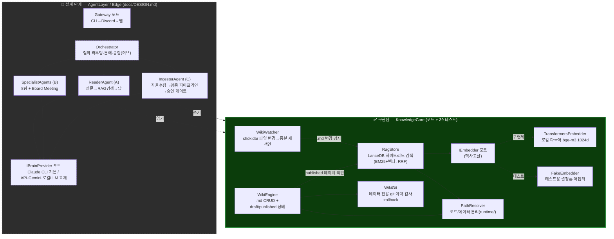

# Engram

> 개인용 stateful LLM 위키(지식 코어)를 단일 진실원으로 두고, 에이전트 무리가 그것을 읽고·협업하고·자율 갱신하는 24/7 셀프호스팅 멀티에이전트 시스템. **현재 토대 레이어(KnowledgeCore)가 코드·테스트로 구현되어 있고, 그 위의 에이전트 계층은 설계가 확정된 상태다.**

---

## 해결한 문제

LLM은 매 대화가 stateless다. 어제 정리한 지식이 오늘 사라지고, 같은 설명을 반복하고, 출처 없이 박힌 틀린 사실이 그대로 누적된다. 개인용 어시스턴트를 24/7로 돌리려면 **대화를 가로지르는 영속 기억(stateful memory)**, 그리고 그 기억이 시간이 갈수록 오염되지 않고 **복리로 쌓이는 구조**가 필요하다.

Engram은 이 문제를 "에이전트에 메모리를 붙인다"가 아니라 **"검증 가능한 지식 저장소(위키)를 단일 진실원으로 두고, 에이전트는 그것을 읽고 쓰는 stateless 워커로 분리한다"**로 푼다. 핵심 통찰: A(읽기)·B(협업)·C(자율 쓰기)는 별도 시스템이 아니라 **같은 지식 코어의 입출력**일 뿐이다. 그래서 코어를 먼저, 단단하게 만든다.

이 저장소는 그 토대(KnowledgeCore)를 실제로 구현한 결과물이다.

---

## 아키텍처

설계는 4개 레이어다. 그중 **KnowledgeCore가 구현 완료**, 그 위 AgentLayer / Edge는 **설계 확정·미구현(로드맵)**이다. 아래 다이어그램에서 실선 박스 = 구현됨, 점선 박스 = 설계 단계.

### 핵심 설계 결정과 '왜'

| 결정 | 왜 |
|---|---|
| **코어 = 단일 진실원, 에이전트 = stateless 워커** | A·B·C가 같은 저장소를 공유해야 쓰기 충돌·중복 기억 없이 복리로 쌓인다. 에이전트마다 별도 메모리를 두면 진실원이 분열된다. |
| **WikiEngine은 단순 .md CRUD가 아니라 '버전관리형'** (출처 frontmatter + git 이력 + draft/published) | C의 자율 쓰기가 진실원을 오염시키는 게 최대 위험. 출처·이력·상태가 *데이터 모델에 내장*되어야 검증·승인·rollback이 가능하다. |
| **벡터 저장소 = LanceDB (임베디드·파일 기반)** | 상시 DB 프로세스 0개. `runtime/rag/`에 파일로 얹혀 단일 프로세스 운영 원칙과 합치하고, 내장 FTS(Tantivy)로 BM25+벡터 하이브리드를 한 저장소에서 처리. |
| **임베딩 = 로컬 다국어(bge-m3) + `IEmbedder` 포트** | 한·영 혼재 지식 대응 + 프라이버시(로컬 유지). 포트로 추상화해 Ollama·API로 교체 가능. |
| **두뇌 = `IBrainProvider` 포트로 추상화** (설계) | LLM 종속을 끊는다. Claude CLI 기본, API·Gemini·로컬 LLM을 어댑터로. 모델·경로·인증은 config 선택(하드코딩 금지). |
| **코드/데이터 분리 (`runtime/`)** | `git pull`이 데이터를 안 건드린다. 프로세스가 죽어도 지식은 파일로 보존 → 고치고 재시작. |
| **셸 스크립트 0개, in-process 스케줄러** | 자율·감사·재색인을 전부 TS 서비스로. 크로스플랫폼 이식성(Windows 네이티브 우선) 확보. |

---

## 기술 스택

import/dependency 기준 **실제로 코드에서 사용 중인** 스택:

- **런타임/프레임워크:** Node.js 22+, TypeScript 5.7, NestJS 11 (DI 컨테이너·모듈·라이프사이클 훅)
- **벡터 DB:** LanceDB (`@lancedb/lancedb` 0.30) + Apache Arrow 18 (스키마) — 하이브리드 검색 + `RRFReranker`
- **임베딩:** Hugging Face Transformers.js (`@huggingface/transformers` 4.2) — 로컬 `Xenova/bge-m3` (1024차원, 다국어)
- **위키/직렬화:** `gray-matter` (frontmatter YAML ↔ 마크다운), `simple-git` (데이터 전용 git 이력)
- **파일 감시:** `chokidar` 4 (위키 변경 → 증분 재색인)
- **테스트:** Jest 29 + ts-jest — TDD (39 테스트), bge-m3 실모델 로딩 통합 테스트 포함
- **(설계 단계 스택)** 두뇌: Claude CLI(`IBrainProvider` 포트) / 스케줄: `@nestjs/schedule`(@Cron)·BullMQ / 게이트웨이: CLI→Discord→웹

---

## 주요 구현

아래는 **실제 코드로 구현되고 테스트된 것**이다. (`src/knowledge-core/`, `src/pal/`)

### 1. WikiEngine — 버전관리형 지식 저장소 ✅
`src/knowledge-core/wiki/wiki-engine.ts`
- 페이지 = `.md` + frontmatter(`sources`, `status`, `category`, `created/updated`). `gray-matter`로 왕복 직렬화.
- **draft → published 상태 머신.** 생성 시 기본 `draft`(검증·승인 전 초안), `publishPage()`로 전환. **published 페이지만 RAG에 색인**된다 — 검증 안 된 초안이 검색 결과를 오염시키지 않는다.
- "통째 교체 금지" 원칙을 코드로 강제: 중복 slug 생성은 `'wx'` 플래그로 실패시킨다.
- `WikiGit`(`simple-git`)로 모든 변경을 **데이터 전용 git 저장소**(`runtime/wiki/`, 코드 repo와 분리)에 커밋 → 감사·rollback 토대.

### 2. RagStore — LanceDB 하이브리드 검색 ✅
`src/knowledge-core/rag/rag-store.ts`
- **하이브리드 검색 = 벡터 최근접(`nearestTo`) + 전문검색(`fullTextSearch`/BM25)을 `RRFReranker`로 융합** — 한 쿼리, 한 저장소에서.
- **멱등 색인:** 같은 페이지를 두 번 색인해도 slug 기준으로 기존 청크를 먼저 삭제 → 중복 방지(테스트로 검증).
- **단일 라이터 직렬화:** 모든 쓰기를 프로미스 큐(`enqueue`)로 순차 처리 — 동시 쓰기 경합 완화.
- FTS 인덱스를 `listIndices()` 기반 idempotent 보장(재오픈 시 stale 인덱스 회귀를 테스트로 방어).

### 3. IEmbedder — 헥사고날 포트 & 어댑터 ✅
`src/knowledge-core/rag/embedder.port.ts`
- **포트:** `IEmbedder` 인터페이스(`dimensions`, `embed`) + DI 토큰(`EMBEDDER` Symbol).
- **운영 어댑터:** `TransformersEmbedder` — 로컬 `bge-m3`(1024d, 다국어), 첫 호출 시 모델 1회 다운로드·캐시. 모델 ID는 환경변수(`ENGRAM_EMBED_MODEL`)로 교체 가능.
- **테스트 어댑터:** `FakeEmbedder` — 결정론적 가짜 벡터(64d, L2 정규화)로 네트워크·모델 없이 단위 테스트.
- **이것이 포트 추상화의 실증이다.** LanceDB 스키마의 벡터 차원이 `embedder.dimensions`에서 나오므로, 임베더를 갈아끼우면 차원이 따라온다. (JD의 "포트&어댑터로 LLM/모델 교체 가능 설계"가 코드로 존재.)

### 4. WikiWatcher — 파일 변경 자동 재색인 ✅
`src/knowledge-core/rag/wiki-watcher.ts`
- `chokidar`로 위키 `.md` 디렉토리 감시 → 변경 시 **증분 재색인**(외부 편집까지 RAG에 반영, stale 읽기 방지).
- slug별 디바운스(300ms, 윈도우 파일 잠금 흡수), `add/change → 색인`, `unlink/draft 강등 → 색인 제거`.
- `OnModuleDestroy`로 워처 정리(좀비 핸들 방지).

### 5. 모듈 와이어링 + 코드/데이터 분리 ✅
`src/knowledge-core/knowledge-core.module.ts`, `src/pal/path-resolver.ts`
- NestJS `onModuleInit`에서 부팅 시퀀스 조율: git repo 보장 → RAG init → published 전체 재색인 → 워처 시작.
- `WikiEngine → RagStore` 단방향 결합을 `PAGE_INDEXER` 포트 + `@Optional` 주입으로 약화(역의존 차단).
- `PathResolver`로 모든 데이터 경로(`runtime/wiki`, `runtime/rag`)를 한곳에서 해소 → 코드/데이터 물리 분리.

### 설계만 된 것 (구현 아님 — `docs/DESIGN.md` 로드맵)
명확히 구분한다. 아래는 **코드가 없다.** `src/agent-layer/`·`src/brain/`·`src/edge/` 디렉토리는 현재 존재하지 않는다.
- **AgentLayer:** Orchestrator(허브-스포크 + TurnBudget), ReaderAgent(A), SpecialistAgents(B: 8팀 + Board Meeting), IngesterAgent(C).
- **`IBrainProvider` 두뇌 포트:** Claude CLI 기본 / API·Codex·Gemini·로컬 LLM 어댑터 — **포트 인터페이스조차 아직 코드에 없음**(설계 문서에만 정의). *RAG 쪽 `IEmbedder` 포트는 실제 구현되어 있어, 같은 패턴을 두뇌에 적용하는 게 다음 단계.*
- **C 자율쓰기 검증 파이프라인:** 추출 → 중요도 게이트(Mem0식 1~5점) → 근거 검증 → 모순 검사 → judge 채점 → **사람 승인 게이트** → git 반영. (안전장치 *설계*. WikiEngine의 draft/published·출처 frontmatter·git 이력이 이 파이프라인을 받기 위한 *토대로 먼저 구현*된 것.)
- **Edge/PAL:** CLI/Discord Gateway, in-process Scheduler, 크로스플랫폼 ProcessSupervisor(Windows Service/launchd/systemd) + 멈춤 감지 감시자.

---

## 결과 / 비즈니스 효과

- **현재 구현 상태:** Phase 0 KnowledgeCore 완료. **39개 테스트**(37 pass / 2 opt-in 실모델 임베더 skip), `tsc`/`nest build` 클린. SDD(스펙 주도 개발) 9태스크 × 2파트로 단계별 머지.
- **데모 가능한 기능 (지금 동작):**
  1. 위키 페이지 생성/수정/발행 + 모든 변경이 git 이력에 출처·커밋으로 남음
  2. published 페이지를 LanceDB에 자동 색인 → 한국어/영어 혼재 질의로 **하이브리드(BM25+벡터) 검색**
  3. 임베더 교체(로컬 bge-m3 ↔ 테스트용 fake)를 코드 변경 없이 DI로
  4. 위키 파일을 외부에서 편집하면 워처가 감지해 자동 재색인
- **비즈니스 가치:** LLM 제품의 가장 비싼 실패(틀린 사실의 영속 오염)를 *데이터 모델 단계에서* 막는, 출처·검증·교체가능성을 내장한 RAG 지식 코어 — LLM 종속 없이 어떤 두뇌로도 갈아끼울 수 있는 토대.

> 정량 성능 지표(검색 정확도/리콜, 인덱싱 처리량 등)는 벤치마크 미수행 — **[지표 확인 필요]**.

---

## 회고

- **설계가 토대를 강제한다.** "에이전트부터 만들고 싶다"는 충동을 누르고 KnowledgeCore를 먼저 단단히 했다. WikiEngine에 출처·상태·git 이력을 *미리* 박아둔 덕에, 아직 안 만든 C 자율쓰기 검증 파이프라인이 얹힐 자리가 이미 준비되어 있다.
- **포트 & 어댑터가 LLM 시대의 보험이다.** `IEmbedder`를 포트로 빼두니 모델 교체가 인터페이스 한 줄이 됐다. 같은 패턴을 두뇌(`IBrainProvider`)에 적용하는 게 자연스러운 다음 수 — 특정 LLM/임베딩 모델에 코드가 묶이지 않는다.
- **하이브리드 검색의 디테일은 라이브러리 버전에 산다.** LanceDB 0.30에서 RRF 후 점수 필드(`_relevance_score` vs `_distance`)·FTS 인덱스 idempotency·chokidar 4 글로브 제거 같은 함정을 통합 테스트와 회귀 테스트로 하나씩 고정했다.
- **개발 방식:** 스펙 주도 TDD(브리프 → 스펙 → 태스크별 테스트 우선 구현 → 태스크/전체 코드리뷰 → 머지)로 진행했고, 설계·구현·검증의 각 단계에서 AI를 페어로 활용해 함정을 조기에 잡았다. 본인은 아키텍처 의사결정(단일 진실원·포트 추상화·코드/데이터 분리)과 설계 정합성·코드 리뷰 판정을 주도하는 역할을 맡았다.
